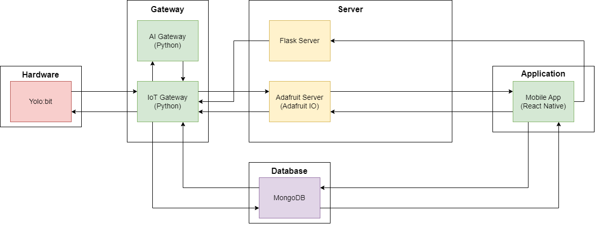
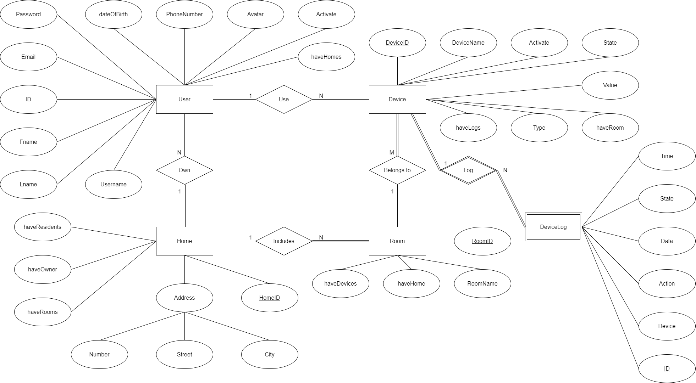
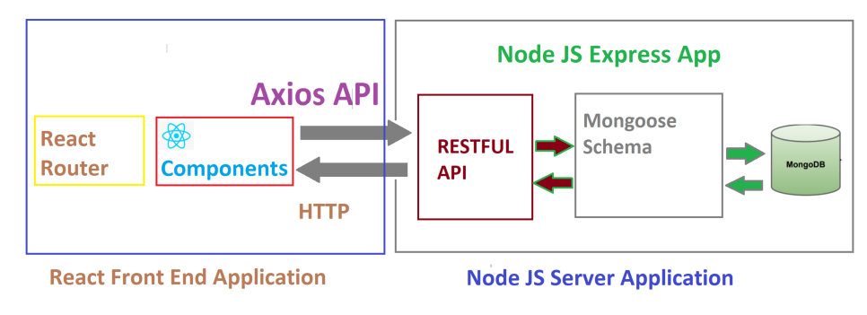
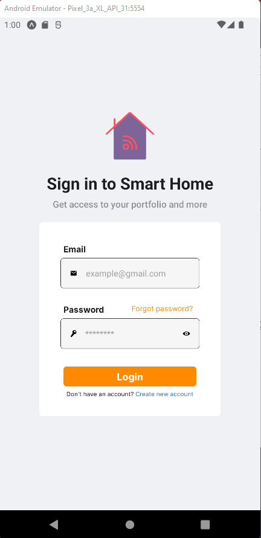
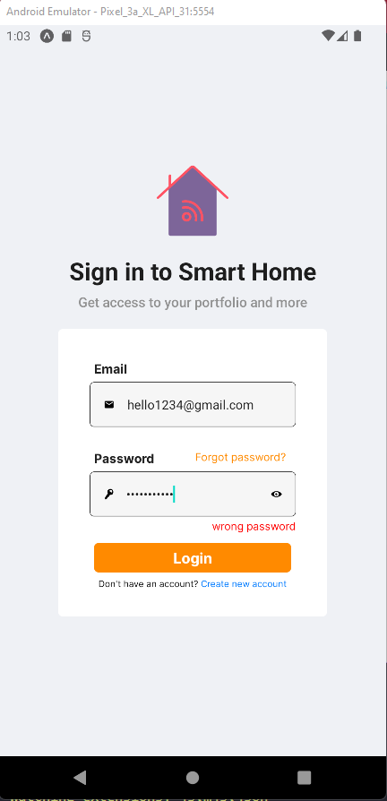
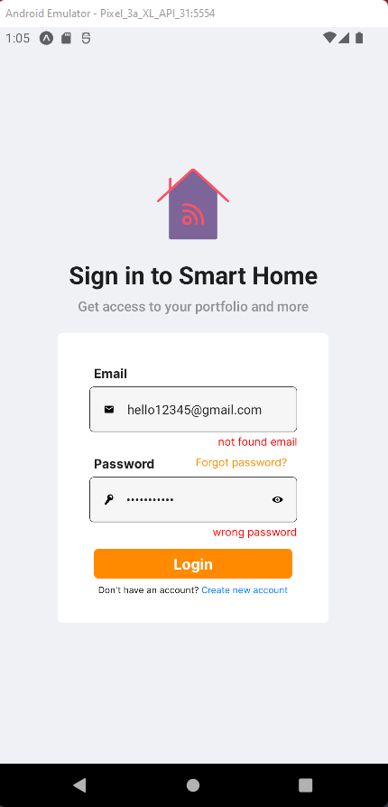
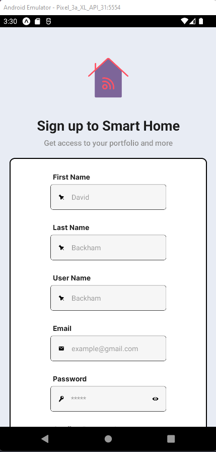
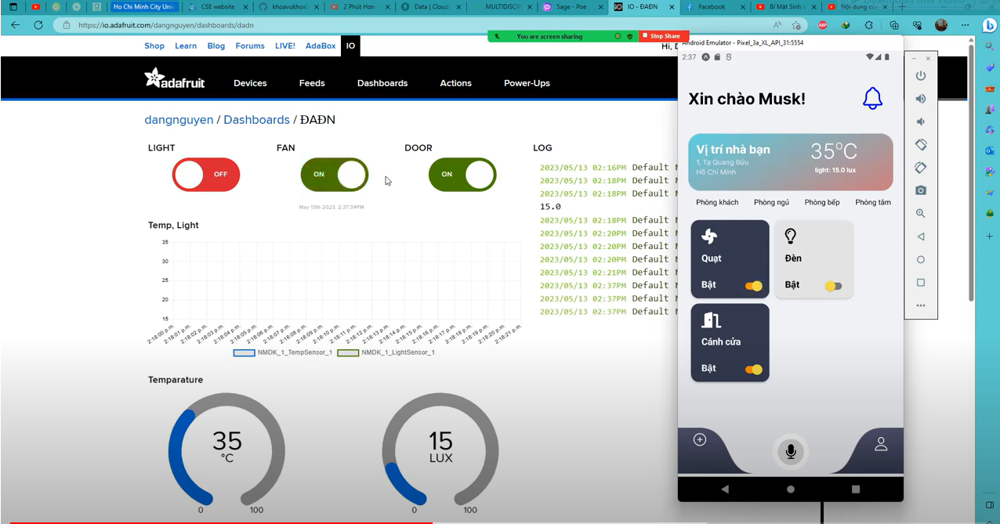

# SMARTHOME MOBILE APP INTERGRATED WITH IOT

## Introduction
In the topic, we introduce the mobile application that following many functions:

- By using the app, you can controll some devices such as: Fan, Door, Bulb in many rooms of your house if your app connects to the backend server.
- The app can perform temperature and light measurements visually.
- The app can notify device actions like: adjust the devices, warning when temperature rises above the allowable limit
-The app can perform device histories to user.
### Members
| Full Name | Main task |
| --------------- | --------------- |
| Nguyen Doan Nhat Minh|Frontend: User Screen, Login Screen, AI module - Flask Python|
| Vu Dang Khoa | Frontend: Login/Logout, HomeScreen, Notification Screen; Backend for account, home, room; design database |
|Nguyen Nhut Nguyen| Frontend: Device Screens, Backend for devices |
|Nguyen Phuc Dang|Hardware, Adafruit...|
### Technologies
* **Frontend**: React Native
* **Backend**: NodeJS, ExpressJS
* **Database**: Mongoose atlas
* **AI Server**: Flask Python
* **Hardware**: See https://github.com/dangnguyenblackie/gateway-sensor
### System Architecture



### Entity-Relationship Diagram



The diagram above has a small mistake. **First**, in the User entity, the attribute *haveHomes* didn't have meaningful relationship. It only existed in the Relational Mapping as foreign key. *haveResident*, *haveOwner*, *haveRooms*, *haveDevices*, *haveHome*, *haveLogs* have the same mistake as *haveHomes*.

### Interaction Diagram between frontend-backend-database


## Implementation result
### Login/ Sign Up/ Log out

1. Login screen:
<div style="display: flex; align: center;">
  
  
  
</div>

2. Sign Up screen / Logout

<!-- [](https://vimeo.com/826428074?share=copy)

[](https://vimeo.com/826425808?share=copy) -->
<p align="center">
    <a href="https://vimeo.com/826425808?share=copy"></a>
    <a href="https://vimeo.com/826428074?share=copy"></a>&nbsp;&nbsp;&nbsp;
  
</p>

You can click to image above, it will link to video (because github readme can't embbed video)
<div style="display: flex;">
    <div>
        <!-- <p style="algin-item: center">Sign up</p> -->
        <iframe src="https://player.vimeo.com/video/826425808?h=cbf7e5aa9d&amp;badge=0&amp;autopause=0&amp;player_id=0&amp;app_id=58479" width="225" height="400" frameborder="0" allow="autoplay; fullscreen; picture-in-picture" allowfullscreen title="Sign up"></iframe>
    </div>
    <div>
        <iframe src="https://player.vimeo.com/video/826428074?h=fb23509466&amp;title=0&amp;byline=0&amp;portrait=0&amp;speed=0&amp;badge=0&amp;autopause=0&amp;player_id=0&amp;app_id=58479" width="225" height="400" frameborder="0" allow="autoplay; fullscreen; picture-in-picture" allowfullscreen title="logout"></iframe>
    </div>
    
</div>

### Home screen & Devices screen
<a href="https://youtu.be/pTK_d-lqZ4M"></a>

You can click to image above, it will link to video (because github readme can't embbed video)
<div>
    <iframe width="560" height="315" src="https://www.youtube.com/embed/pTK_d-lqZ4M" title="YouTube video player" frameborder="0" allow="accelerometer; autoplay; clipboard-write; encrypted-media; gyroscope; picture-in-picture; web-share" allowfullscreen></iframe>
</div>

## How to run:
Assuming that we are in 'DADN_TTNT' folder. First, we need to run backend server:
```bash
    cd backend
    nodemon server
```
If you don't have anything in node_modules in backend, you need to install it first, use command: 
```bash
    npm install --save
```
If the terminal showed: 'our db is connected', it means that server is running and connected successfully.

***Note:*** you need to make sure that the AIO_KEY and AIO_USERNAME in the .env in backend must be corrected.

Then, go back to 'DADN_TTNT' folder, then go to frontend by typing:
```bash
    cd frontend
    npx expo start
```

***Note:*** The frontend requires node_modules, too. Make sure that the ip address of the backend server in /API/client.js must be corrected. If you are in development mode, try to get this IP in the Ipv4 of your network.

